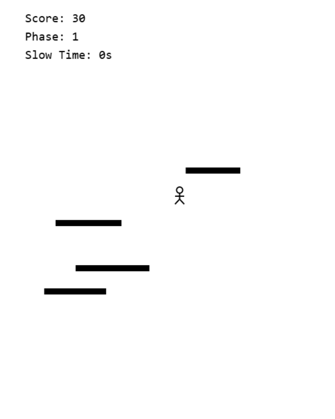
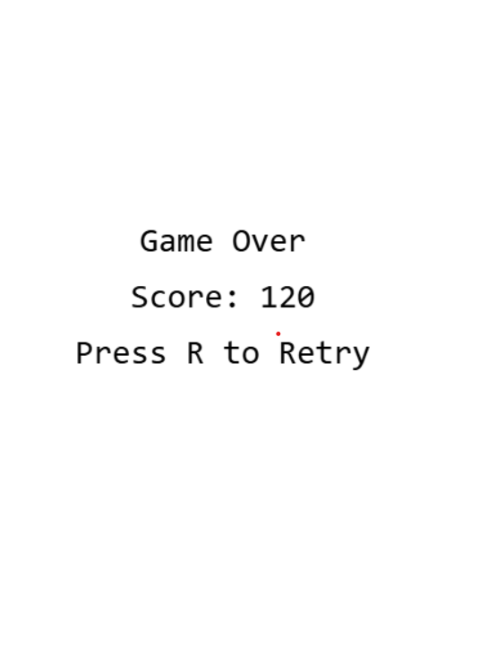

### 🎮 Signal Slicer

Signal Slicer is a fast-paced, retro-style survival game where you must navigate an ever-increasing stream of data.

---

### 🕹️ How to Play

* **Objective:** Maneuver your character to collect white signal bars while avoiding black obstacles.
* **Controls:** Use the **Arrow keys** or **WASD** to move. Press the **Space bar** to briefly slow down the obstacles.
* **Scoring:** You get **10 points** for every white signal bar you collect.
* **Game Over:** Hitting a black obstacle ends the game.

---

### 📈 Progression

The game gets harder as you play:

* **Phases:** The game progresses into a new "phase" every 15 seconds.
* **Difficulty:** With each new phase, the obstacles move faster and appear more frequently.
* **Obstacles:** The obstacles become more complex, with more types of obstacles and more speed.

