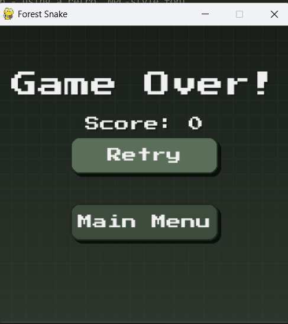

Forest Snake
Overview
A Pygame-based Snake game with a forest theme, retro NPC-style font, and responsive UI.
Features

Forest-themed gradient background and grid.
Pixelated font (PressStart2P-Regular.ttf).
Menu, gameplay, and game over screens.
Cross-platform (desktop and web via Emscripten).

Requirements

Python 3.x
Pygame 2.x (pip install pygame)
PressStart2P-Regular.ttf (download from Google Fonts)

Installation

Install Pygame: pip install pygame
Place PressStart2P-Regular.ttf in the script directory.
Run: python snake.py

Controls

Arrow Keys/WASD: Move snake.
Mouse Click: Menu buttons (Start, Exit, Retry, Main Menu).
Close Window: Exit game.

Gameplay

Collect apples to grow and score.
Avoid walls and self-collisions.
Retry or return to menu on game over.

Files

snake.py: Game script.
PressStart2P-Regular.ttf: Font file.

Notes

Ensure font file is present to avoid fallback.
FPS adjustable in code (FPS = 10).

License
For personal use. Check font license for redistribution.

